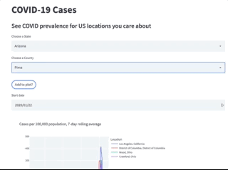

# Easily see COVID case data for desired US counties (sometimes cities)

Use the interactive app [here](https://share.streamlit.io/discdiver/covid-cities/main/app.py).

State level data isn't fine grained enough for showing how prevalant covid cases are in many locations. I created this app in an attempt to make it easier for users to see covid prevalence in smaller geographic regions throughout the United States. Data comes from the [New York Times](https://github.com/nytimes/covid-19-data/tree/master/rolling-averages).